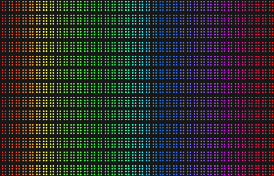

# dots

[](https://pkg.go.dev/github.com/imjasonh/dots)

Convert images to braille art in the terminal with ANSI colors.

```
$ dots -w 40 testdata/rainbow_gradient.png
```



## Install

```bash
go install github.com/imjasonh/dots/cmd/dots@latest
```

## CLI Usage

```bash
# Auto-fit to terminal, maintain aspect ratio
dots image.png

# Specify width (height calculated from aspect ratio)
dots -w 80 image.png

# Specify both dimensions
dots -w 80 -h 40 image.png

# Add background color
dots -background ff0000 image.png
```

## Library Usage

```go
import "github.com/imjasonh/dots"

img, _ := loadImage("photo.png")
lines := dots.Convert(img, dots.Options{
    Width:  80,
    Height: 40,
})
for _, line := range lines {
    fmt.Println(line)
}
```
